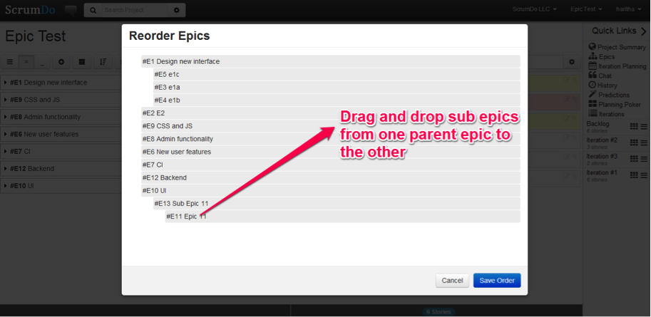
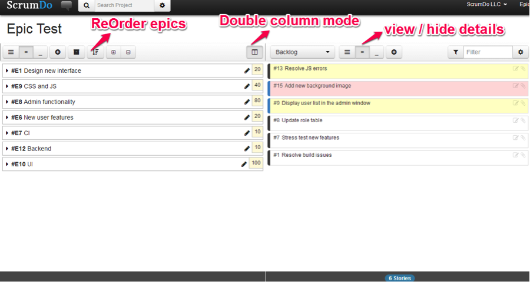

### Improved Epic Management 

  
As Scrum practitioners, we recognize Epics as very large user stories. Good practice calls for us to break epics down into smaller chunks that we can accomplish within a relatively small time period.  We recently upgraded ScrumDo’s Epics interface to improve overall Epics management within the system. 

  
To start, it is now easier to drag and drop sub-epics among parents through the Reorder Epics window.  

  

  
Users can also select the level of details to display under selected epics, sub-epics and stories by toggling among the options provided along the top of the interface:

* option 1 button (has most horizontal bars) displays everything under selected epic

* option 2 ( has a couple of horizontal bars) hides the epic detail fields

* option 3 ( has one horizontal bar) hides the story list 

  

  
Perhaps the most significant improvement lies in our new double column toggle.  This allows users to view a story list on the right side panel.  Product planning is now even easier through this improved drag and drop functionality enabled by the dual column mode (and you can even filter the story list if you’re looking for something specific).

